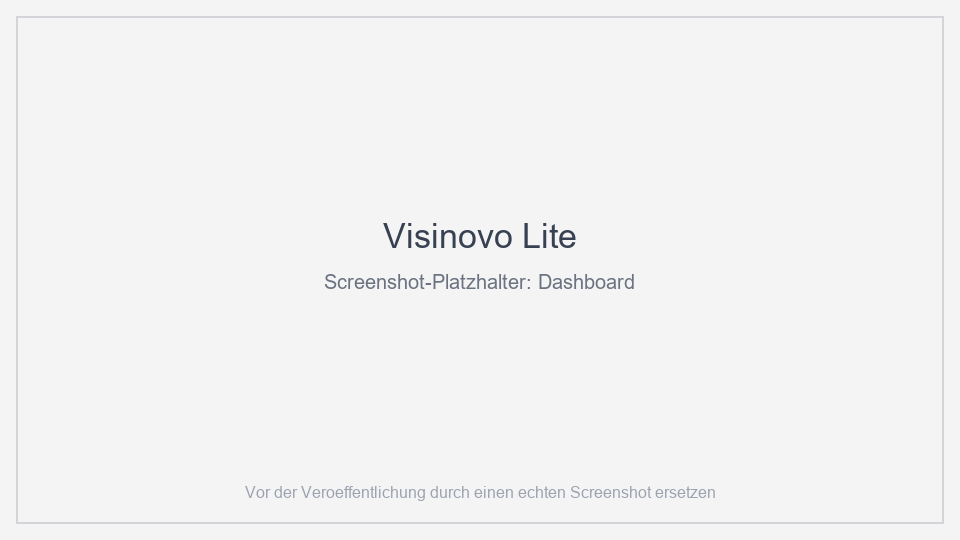
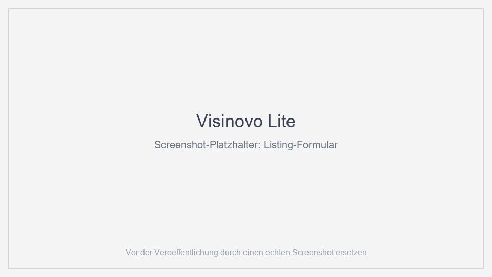
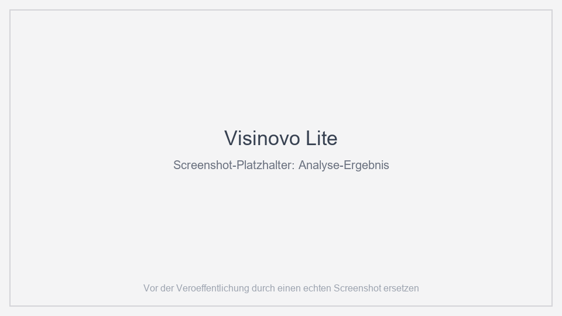

# Visinovo Lite

**Kostenlose Windows-Desktop-App: Analysiere die Texte deiner digitalen
Listings – komplett lokal, ohne Konto, ohne Cloud.**

Visinovo Lite hilft Dir, Titel, Beschreibung und Tags Deiner digitalen
Listings (z. B. für Etsy) zu verbessern – mit einem Qualitätsscore,
Teilbewertungen und konkreten, regelbasierten Verbesserungsvorschlägen.
Alle Daten bleiben **ausschließlich auf Deinem Computer**.

## Funktionen

- **Listing-Check (Analyse):** Qualitätsscore von 100 Punkten,
  Teilbewertungen und konkrete Verbesserungsvorschläge für Titel,
  Beschreibung und Tags – inkl. Titelvorschlag und bis zu 13
  Tag-Vorschlägen.
- **Listings verwalten:** bis zu **3 Listings** lokal speichern
  (Titel, Beschreibung, Kategorie, Tags, Preis, Markt, Zielgruppe).
- **Keyword-Analyse:** Chancen-Bewertung (0–100) für Suchbegriffe.
- **CSV-Import:** importiere exportierte Statistiken (z. B. aus Etsy)
  und verbinde sie mit Deinen Listings.
- **Experimente:** dokumentiere Tests von Änderungen an Titeln,
  Beschreibungen oder Tags und verfolge deren Wirkung.
- **Berichte:** druckbare HTML- und PDF-Berichte zu einer Analyse.
- **Lokale Einstellungen:** Datenpfad, Version und „Daten zurücksetzen“.

> Hinweis: Die Analyse basiert auf klaren, lokal ausgeführten
> Regeln und Listen (z. B. deutsche Stopwörter, Titel-/Tags-Limits).
> Es werden **keine KI-Dienste** und **keine externen APIs** genutzt.

## Ein Blick ins Detail

Das Listing-Formular ist aus dem gewählten Listing vorausgefüllt –
Titel, Beschreibung, Tags & Co. kannst Du vor jeder Analyse anpassen.

Das Analyse-Ergebnis zeigt den Qualitätsscore, die sechs
Teilbewertungen sowie Stärken und konkrete Verbesserungsvorschläge.

## Voraussetzungen

| | |
|---|---|
| Betriebssystem | Windows 10 oder 11 (64-Bit) |
| Rechte | **Keine** Administratorrechte (User-Installation) |
| Python/Node | nicht erforderlich (selbstständige App) |
| Internet | **nicht erforderlich** für alle Funktionen |
| Desktop-Fenster | Microsoft Edge WebView2 Runtime (in Windows 11 enthalten; auf Windows 10 meist bereits installiert) |

## Installation (in Kürze)

1. Die aktuellste **Setup-EXE** von den [Releases](https://github.com/visinovo/visinovo-lite/releases) herunterladen.
2. Die Datei ausführen – der Installer installiert **ohne Admin** unter Deinem Benutzerkonto.
3. Die App starten. Beim ersten Start wird die lokale Datenbank angelegt – danach läuft alles offline.

Die vollständige Anleitung mit **Prüfsummen-Verifikation (SHA-256)** und
Hinweisen zu SmartScreen-Warnungen findest Du in der
[Installationsanleitung](docs/INSTALLATION.md).

## Demo-Listing beim ersten Start

Beim ersten Start legt die App automatisch ein **Beispiel-Listing**
(„Stirnholzbrett aus Birke“ – handgemachtes Schneidebrett) mit drei
Analysen und Score-Verlauf, 8 Wochen Shopstatistik und einem
abgeschlossenen Optimierungsexperiment an – so kannst Du alle
Funktionen direkt ausprobieren. Alle Werte sind eindeutig erkennbare
**Beispieldaten**; das Listing kannst Du jederzeit löschen.

## Deinstallation

Die App wird über die Windows-Systemeinstellung *Apps* (bzw.
*Programme und Features*) deinstalliert. **Deine Daten bleiben dabei
standardmäßig erhalten** – der Deinstaller fragt explizit, ob
`%LOCALAPPDATA%\Visinovo` gelöscht werden soll.
[Deinstallationsanleitung](docs/DEINSTALLATION.md).

## Deine Daten bleiben bei Dir

- Alle Daten liegen lokal unter **`%LOCALAPPDATA%\Visinovo`**
  (Datenbank, Logs, Exporte).
- **Kein** Cloud-Upload, **keine** Telemetrie, **kein** Tracking,
  **kein** Account.
- Die App ist nur auf **`127.0.0.1`** (Dein eigener Rechner) erreichbar
  und braucht für ihre Funktionen **keine Internetverbindung**.

Details im [Datenschutzhinweis](docs/DATENSCHUTZ.md).

## Lizenz & Support

- Visinovo Lite ist **Freeware** – die Nutzung ist kostenlos. Bitte
  lies die [Lizenzbedingungen (EULA)](LICENSE.md) vor der Installation.
  Die Software ist **keine** Open-Source-Veröffentlichung.
- Fehlerberichte, Ideen und Fragen:
  [GitHub Issues](https://github.com/visinovo/visinovo-lite/issues)
  (siehe [Support](docs/SUPPORT.md)).
- Wenn Dir Visinovo Lite gefällt und Du das Projekt unterstützen
  möchtest, hilft das sehr:
  [GitHub Sponsors](https://github.com/sponsors/visinovo) ·
  [Ko-fi](https://ko-fi.com/visinovo) ·
  [Liberapay](https://liberapay.com/visinovo)
  (Links öffnen sich im externen Browser – die App selbst stellt
  keine Verbindung dazu her).

## Repository-Inhalt

Dieses Repository enthält **keinen Quellcode**, sondern die
Dokumentation, die Lizenz und die Freigabe-Prozesse. Die Installationsdatei
wird als **GitHub-Release** bereitgestellt. Die aktuelle Prüfsumme steht
in [`SHA256SUMS.txt`](SHA256SUMS.txt) und im
[Changelog](CHANGELOG.md).
